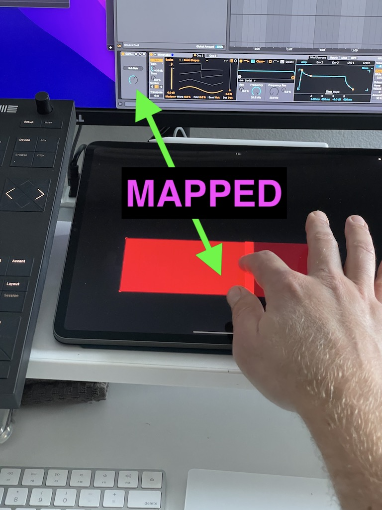

# Current Param Knob

This is a Max For Live device that provides a single knob that is always connected to the currently selected parameter.

This allows you to use a single MIDI controller to adjust whatever parameter is selected on the Live Set, even in different tracks.

## Installation

[Download the newest .amxd file from the frozen/ directory](https://github.com/zsteinkamp/m4l-CurrentParamKnob/tree/main/frozen/) or clone this repository, and drag the `CurrentParamKnob.amxd` device into a track in Ableton Live.

## Usage

Press Cmd-M to enter MIDI mapping mode. Click the knob in the device, then move whatever MIDI controller you want to use. Press Cmd-M to exit MIDI mapping mode. Now, no matter what parameter is selected in the Live Set, that MIDI controller will change its value.

I like to use a large TouchOSC control slider to give a large, high-fidelity target.

## TODO

* ...

## Changelog

* 2022-04-09 - [0.0.1](https://github.com/zsteinkamp/m4l-zs-CurrentParamKnob/raw/main/frozen/CurrentParamKnob.0.0.1.amxd) - Initial Rev

## Contributing

I'd love it if others extended this device. If you would like to contribute, simply fork this repo, make your changes, and open a pull request and I'll have a look.
