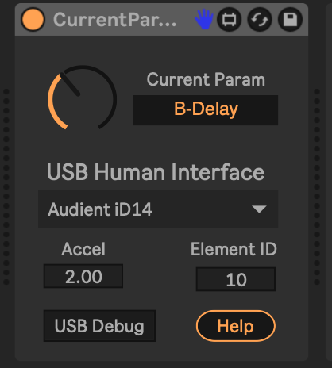

# Current Param Knob

This is a Max For Live device that lets you map a MIDI controller or USB Human Interface Device to the currently selected parameter.

No mapping is necessary -- the currently selected parameter is always connected to the knob.

## Installation

[Download the newest .amxd file from the latest release](https://github.com/zsteinkamp/m4l-CurrentParamKnob/releases) or clone this repository, and drag the `CurrentParamKnob.amxd` device into a track in Ableton Live.

## Usage

### MIDI Control

Press Cmd-M to enter MIDI mapping mode. Click the knob in the device, then move whatever MIDI controller you want to use. Press Cmd-M to exit MIDI mapping mode. Now, no matter what parameter is selected in the Live Set, that MIDI controller will change its value.

## Changelog

* 2025-03-31 - [2](https://github.com/zsteinkamp/m4l-zs-CurrentParamKnob/raw/main/frozen/CurrentParamKnob-v2.amxd) - Add USB Human Interface capability.
* 2022-04-09 - [0.0.1](https://github.com/zsteinkamp/m4l-zs-CurrentParamKnob/raw/main/frozen/CurrentParamKnob.0.0.1.amxd) - Initial Rev

## TODO

* ...
