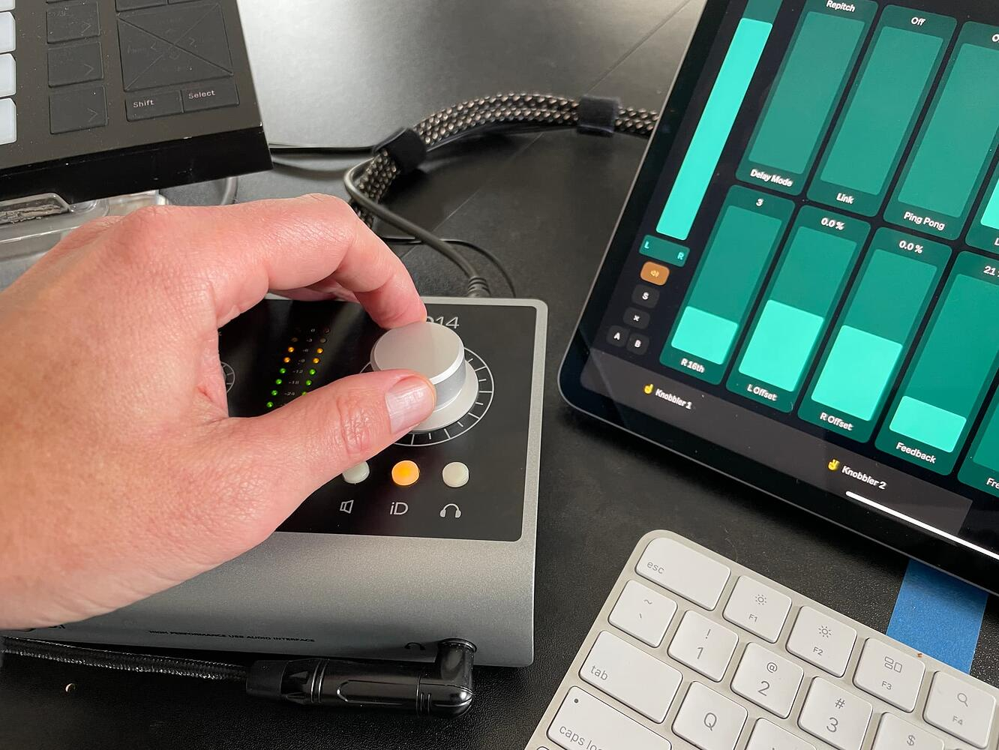

# Current Param Knob

This is a Max For Live device that lets you map a MIDI controller or USB Human Interface Device to the currently selected parameter.

No mapping is necessary -- the currently selected parameter is always connected to the knob.

## Installation

Use a download link at the top or bottom of this page, or [download the newest .amxd file from the latest GitHub release](https://github.com/zsteinkamp/m4l-CurrentParamKnob/releases) or clone [this repository](https://github.com/zsteinkamp/m4l-CurrentParamKnob), and drag the `CurrentParamKnob.amxd` device into a track in Ableton Live.

## Usage

### MIDI Control

Press Cmd-M to enter MIDI mapping mode. Click the knob in the device, then move whatever MIDI controller you want to use. Press Cmd-M to exit MIDI mapping mode. Now, no matter what parameter is selected in the Live Set, that MIDI controller will change its value.

### USB Control

I added this functionality so I could use the knob on my Audient iD14 interface as a Current Param Knob. I have no idea if it will work with other devices, so I'm just taking a good guess here with configuration / configurability.

Hypothetical mapping process:
* Choose your USB device from the drop-down.
* Enable `USB Debug` mode to print data received from that device in the Max console. To see the console, right-click the title bar of this device and choose `Open Max Window`.
* Move whatever controller you want to use.
* Note the output in the Max console window. The output is `{element} {value}`.
  * My iD14 knob outputs as element 10, so that's why it is the default.
* Change the `Element ID` field to the element your controller is emitting.
* ... at this point the controller should be able to move the dial.
* Adjust the `Accel` value to give you the feeling you want with your controller.

## Changelog

* 2025-03-31 - [2](https://github.com/zsteinkamp/m4l-zs-CurrentParamKnob/raw/main/frozen/CurrentParamKnob-v2.amxd) - Add USB Human Interface capability.
* 2022-04-09 - [0.0.1](https://github.com/zsteinkamp/m4l-zs-CurrentParamKnob/raw/main/frozen/CurrentParamKnob.0.0.1.amxd) - Initial Rev

## TODO

* ...
